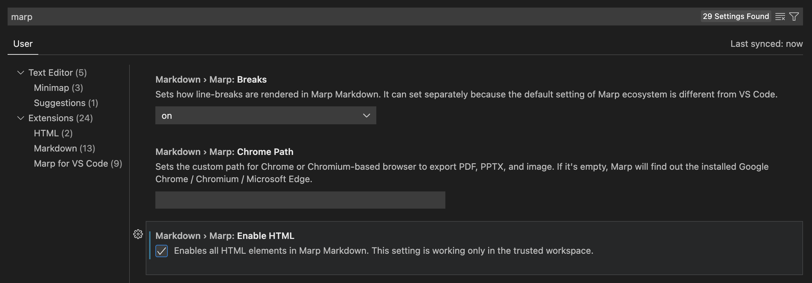

# TITLE OF THE KEYNOTE

<p style="font-size:30pt; padding-top:20px">Your Name</p>

<p style="font-size:25pt; padding-top:10px">Organization</p>

<p style="font-size:20pt; padding-top:25px">Date</p>

---

## About this template

- [Markdown source code of this template]()
- [MARP-Tutorial Github Repository]()
- Please [contact](mailto:howardhsumail@gmail.com) the [author](https://www.haochehsu.com) for help, comments, error reporting.

---

<span style="font-size:35px">The ability to create slides with speed and finesse: `vscode` + `MARP`</span>

<div style="display:flex;align-items:center;justify-content:center;padding-top:50px">
  

  <div style="padding:0px 50px 0px 60px">+</div>

  
</div>

---

<div style="line-height:40px">

## Resources

1. [MARP](https://marp.app/#get-started) ([YouTube Quick Demo](https://www.youtube.com/watch?v=OmKtuBXNjac&ab_channel=BetterDataScience))
1. [MARP Github](https://github.com/marp-team) ([MARP VScode](https://github.com/marp-team/marp-vscode), [MARP Core](https://github.com/marp-team/marp-core))
1. [VScode Extension](https://marketplace.visualstudio.com/items?itemName=marp-team.marp-vscode)
1. [Marpit](https://marpit.marp.app/)

<p style="margin-top:-10px;margin-bottom:25px">Don't forget to "Enable HTML" in the VScode MARP settings:</p>



</div>

---

# PAGE TTITLE
#### SUBTITLE HERE

Aenean quam felis, tristique vel iaculis sollicitudin, iaculis nec sem. Nulla venenatis sem lorem, at mollis nulla semper vel. Morbi.

---

## Unordered List

- Item 1
- Phasellus imperdiet quam ultricies, scelerisque sem lacinia, egestas libero. Praesent.
  - Item 2a
    - Item 2ai

---

## Ordered List

1. Item 1
1. Item 2
    - Item 2a
1. Morbi gravida, ligula non gravida sodales.
    - Item 3a
      - Item 3ai

---

## Text format

<div style="display: flex; line-height:30px">

<div style="flex: 50%">

**Bold** text or <b>Bold</b>

*Italic* text or <em>Italic</em>

<u>underline</u> text

<del>strikethrough</del> text

***Bold and Italic*** text

<mark>marked</mark> text

</div>

<div style="flex: 50%;">

<span style="color: #23B034">Customized color</span> text

text <sup>SUPscript</sup>

text <sub>SUBscript</sub>

<span style="font-size: 50px">Customized size</span> text

<!-- Arial/Verdana/Helvetica/Tahoma/Trebuchet MS/Times New Roman/Georgia/Garamond/Courier New/Brush Script MT -->
<span style="font-family:Brush Script MT;">Customized font</span> text

</div>
</div>

---

## Alignment

<div style="line-height:40px">

<div style="text-align: left; padding-top:30px">
The following text is <b>aligned left</b>. Duis in tempor nisi, eget lobortis velit. Nunc consequat, urna.
</div><br>

<div style="text-align: right;">
The following text is <b>aligned right</b> Duis in tempor nisi, eget lobortis velit. Nunc consequat, urna.
</div><br>

<div style="text-align: justify;">
The following text is <b>aligned justify</b> Duis in tempor nisi, eget lobortis velit. Nunc consequat, urna.
</div><br>

<div style="text-align: center;">
The following text is <b>aligned center</b> Duis in tempor nisi, eget lobortis velit. Nunc consequat, urna.
</div>

</div>

---

## Spacing

<div>

Use `&nbsp;` to add &nbsp; &nbsp; &nbsp; **horizontal** spacing.

Use `<br>` to add <br><br><br> **vertical** spacing.

<div style="margin-bottom:3cm;"></div>

or with HTML `<div style="margin-bottom:3cm;"></div>`.

</div>

---

## Hyperlink

- External link: [www.haochehsu.com](https:www.haochehsu.com)

- Internal link: | [Go to "Unordered List" slide](#6) | [Go to Front Page](#0) |

---

## Math

Given $y$, $x$, $\Delta$, $\nu$, $\eta$, with the following matrices

<div style="font-size:18pt">

$$\mathcal{L}=\begin{pmatrix}
1 & 2 & 3 & 4 & 5 \\
3 & 4 & 5 & 6 & 7
\end{pmatrix} \text{and} \prod=\begin{vmatrix}
A &B  &C \\
D&  E& F
\end{vmatrix}$$
</div>

<div style="text-align:left;padding-left:2.5cm">Math alignment:</div>

<div style="font-size:18pt">

$$\begin{align}
  y&=\underset{\pi}{\mathbb{E}}\Big(\beta x + \epsilon\Big)\neq\sum\limits_{i}\beta_i(\underbrace{\alpha+\xi}_{\text{variables}}) + \epsilon\\
  &\nonumber\Longrightarrow \int_{0}^{10}r \left( \dfrac{r}{50} \right)dr\xrightarrow{\text{text here}}\dfrac{r^{3}}{150}\biggr\rvert^{10}_{0}, \forall x\in (a,b)
\end{align}$$

So from $\widehat{ABCD}$, $\widetilde{ABCD}$, $\widehat{ABCD}$, $\overrightarrow{ABCD}$, and $\overline{ABCD}$, we get the desire $\underline{\text{result}}$.
</div>

---

## Inline code

<div style="line-height:30px; font-size:30px">

`mylist = list(filter(lambda x: 'words' not in x, mylist))`

<br>

#### <div style="margin-top:-10px;">Block code</div>


```python
# Long short-term memory (LSTM)
def __init__(self, input_size=1, hidden_size=256, output_size=1):
        super().__init__()
        self.hidden_size = hidden_size
        self.lstm = nn.LSTM(input_size, hidden_size)
        # fully-connected
        self.linear = nn.Linear(hidden_size, output_size)
        self.hidden = (
            torch.zeros(1, 1, self.hidden_size),
            torch.zeros(1, 1, self.hidden_size)
        )
```

</div>

---

## Image

<div style="padding-top:30px" >
  
</div>

---

## Table

<div style="font-size:30px">

| Left-aligned   |      Centered      |  Right-aligned |
|----------------|:------------------:|---------------:|
| Row 1 |  left-aligned | $1600 |
| Row 2 |    centered   |   \$$9\frac{3}{4}$ |
| Row 3 | right-aligned |    $1 |

<table border="3">
 <tr align="center">
    <td><b style="font-size:30px">Index</b></td>
    <td><b style="font-size:30px">Title</b></td>
    <td><b style="font-size:30px">Values</b></td>
 </tr>
 <tr>
    <td>Lorem ipsum</td>
    <td>Nulla venenatis ipsum</td>
    <td>94087</td>
 </tr>
 <tr>
    <td>Morbi Lorem sodales</td>
    <td>ligula non gravida</td>
    <td>95051</td>
 </tr>
 <tr>
    <td>sem lacinia</td>
    <td>Lorem ipsum Lorem ipsum</td>
    <td>94040</td>
 </tr>
</table>

<div>

---

<!-- backgroundImage: "linear-gradient(to bottom, #F7FFAA, #D0F6FF)" -->

Gradient background

<!-- CSS -->
<style>
a {
  text-decoration: none;
}
*{
  font-family: Tahoma;
}
</style>